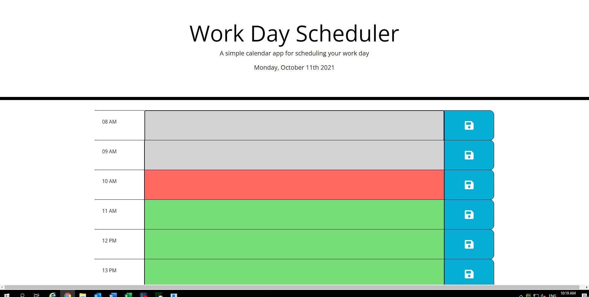
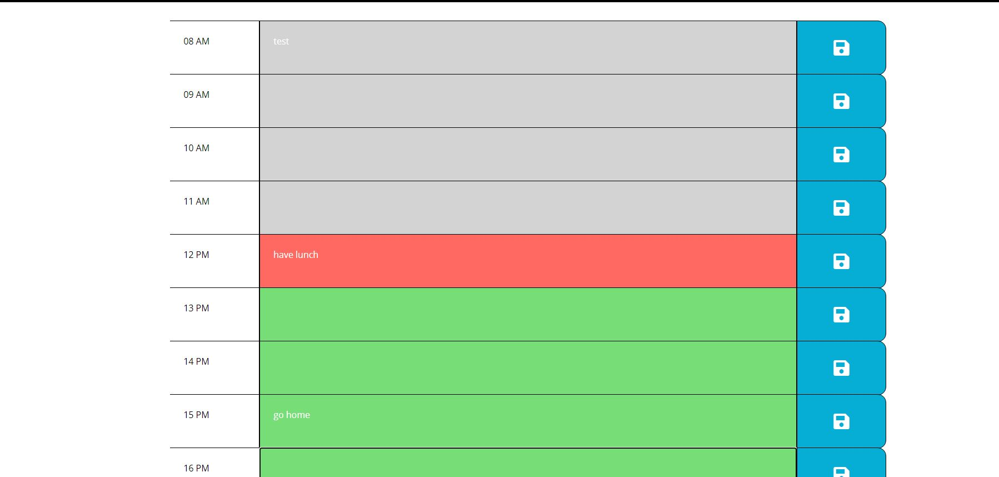
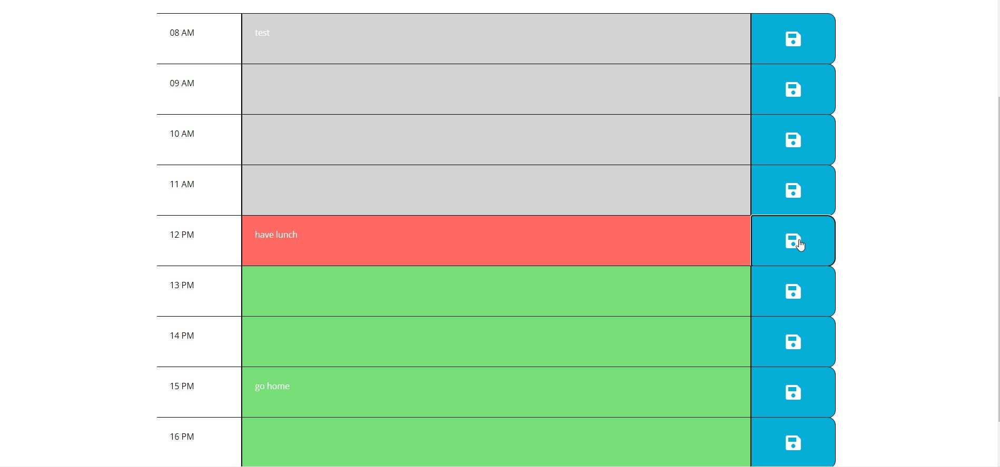

# Work Day Scheduler

## Short description

 A simple calendar application that allows a user to save events for each hour of the day by modifying starter code.

```
GIVEN I am using a daily planner to create a schedule
WHEN I open the planner
THEN the current day is displayed at the top of the calendar
WHEN I scroll down
THEN I am presented with timeblocks for standard business hours
WHEN I view the timeblocks for that day
THEN each timeblock is color coded to indicate whether it is in the past, present, or future
WHEN I click into a timeblock
THEN I can enter an event
WHEN I click the save button for that timeblock
THEN the text for that event is saved in local storage
WHEN I refresh the page
THEN the saved events persist
```

## Table of Contents

- [Screenshots](#screenshots)
- [Github](#github)

## Screenshots








## Github

1. I have created a new repository on your GitHub account and clone it to my computer.

2. I used the `git add`, `git commit`, and `git push` commands to save and push my code to my GitHub repository.

3. My repository is https://github.com/gharduim/work-day-scheduler

4. My live webpage is  https://gharduim.github.io/work-day-scheduler/
